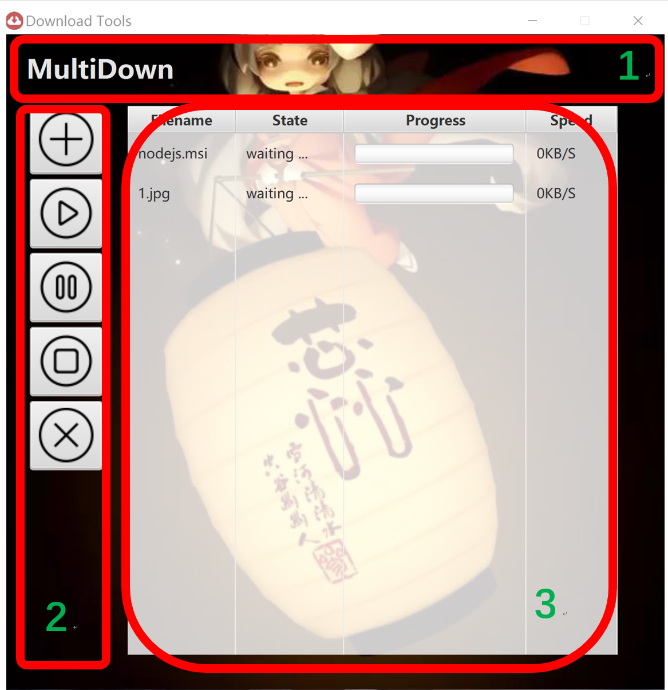
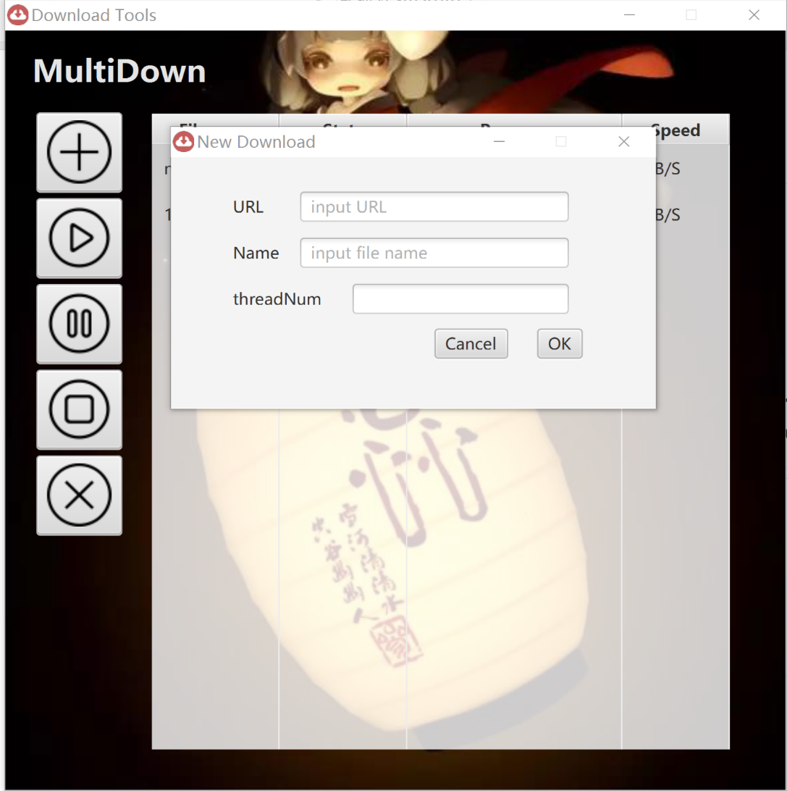
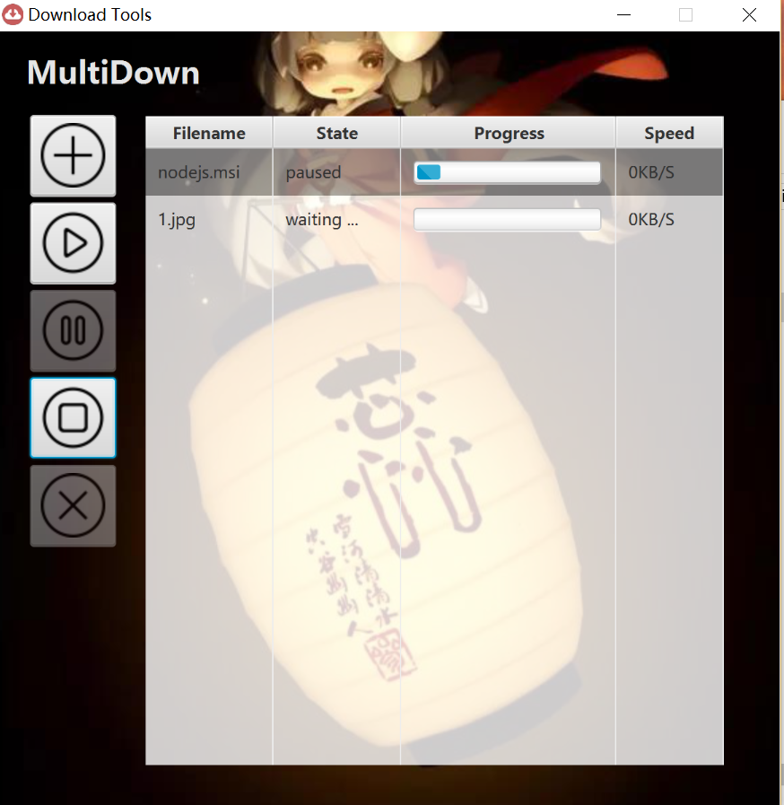

# JavaFx-download-tool
a download tool using javafx for GUI. It is my semester project.

设计语言：javafx+java
IDE: intelliJ idea
下载工具：功能包括多线程、多文件、断点续传。
GUI部分：进度条及下载速度的显示，tooltip，根据状态禁用按钮等。

新建下载：

下载中：

界面部分使用javafx，设计以及按钮参考了：https://github.com/m7mdkamal/DownloadLite

这是我一门课的大作业，写得很不完善。之所以放上来，是想为同样用javafx写大作业的人提供一些参考。

最后感谢Stackoverflow上回答问题的人们，我在写这次大作业的过程中，遇到的几乎所有问题都能在上面找到答案。
